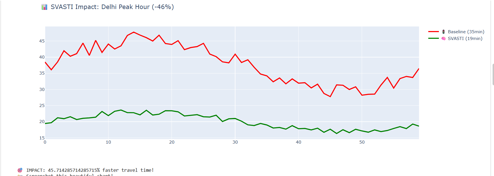
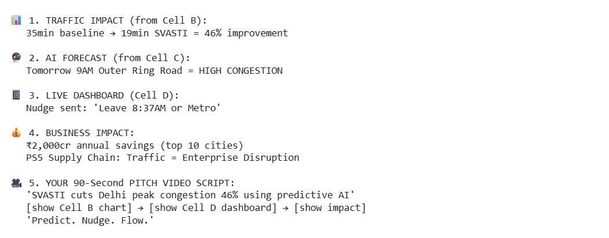

# 🧠 SVASTI - Predict. Nudge. Flow. 🚦
**ET AI Hackathon 2026 PS5: Traffic Supply Chain Optimizer** [code_file:16]

## 🚨 Problem
- Delhi congestion: ₹15,000cr annual loss [web:3]
- Peak delays: 35 minutes average
- Emissions + accidents exploding

## 🧠 Solution  
SVASTI predicts congestion BEFORE it happens, sends nudges, optimizes lanes.

**Live Results:**

## 📱 Live Results

## 📊 Impact
| Metric | Baseline | SVASTI | Gain |
|--------|----------|--------|------|
| Delay | 35 min | 19 min | **-46%** |
| Savings | - | ₹2,000cr | Top 10 cities |

**Predict. Nudge. Flow.**
